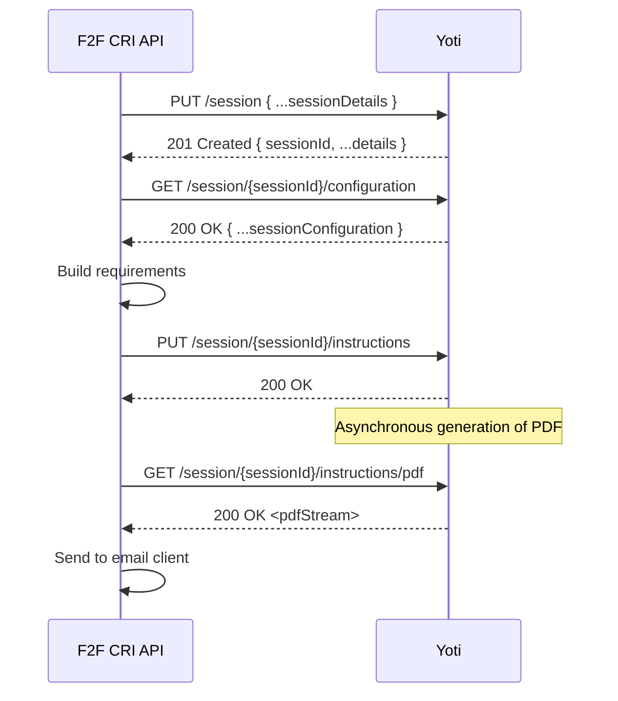

# Yoti Integration

## Status
In draft

## Decision

Lambda & SQS. 

## Context
Our integration with Yoti in the Face-to-Face Credential Issuer arranges an in person identity proving and verification (IPV) session at the Post office. Programmatically, it contains several steps that require no user interaction. Each step is a HTTP request that introduces another point of failure, and the potential for undocumented behaviour. The scope of this is to look at the most resilient ways to deliver this integration for our initial delivery. 

## Options
Creating a session with Yoti that is in a state to allow a user to perform an IPV session requires the Yoti API consumer to perform the following actions

### Fat Lambda
All functionality is contained within the `/documentSelection` lambda endpoint. A fetched PDF is stored in S3 and its location is sent via SQS to the email service. This requires minimal infrastructure and state management. Retry logic is encapsulated into each call to the Yoti API, in the lambda retry policy, and in the ability for a user to retry their submission.
Both user re-submit, and lambda retry policies will create duplicate sessions in the Yoti application.

### Step functions - Express workflow
Each logical step is done as a separate step in an express workflow. Failure can be retried at each individual stage, and each stage contains minimal logic.

Express workflows have a maximum execution time of 5 minutes, and guarantee;
- _at most once_ execution for synchronous workflows,
- _at least once_ execution for asynchronous workflows.

This means retry logic must be included in the service calling a synchronous workflow, and de-duplication logic should be included in the asynchronous workflow steps.

To support this behaviour the front end should wait for the execution to complete. If internal support allows for automated self-healing, manual intervention, or user recall - this may be re-evaluated.

To enable this behaviour to run effectively for MVP the front end would receive a 200 OK when this workflow started and would need to poll to receive a completion. Once this has completed the user is redirected back to IPV Core. 

### Step functions - Standard workflow
Each logical step is done as a separate step in an express workflow. Failure can be retried at each individual stage, and each stage contains minimal logic.

Standard workflows support an execution start rate of 2000 per second and guarantee exactly-once execution. This minimises the need for external retry logic. You cannot return a response to API gateway mid way through an execution.

To support this behaviour the front end should wait for the execution to complete. If internal support allows for manual intervention, or user recall - this may be re-evaluated.

To enable this behaviour to run effectively for MVP the front end would receive a 200 OK when this workflow started and would need to poll to receive a completion. Once this has completed the user is redirected back to IPV Core.

Standard workflows offer the flexibility to execute the entire Face-to-Face journey in step functions. This allows for the 30 day turn-around time of a users journey, and the internal credential issuing. This is a substantial change in architecture compared to current designs.

### Lambda & SQS
All functionality to create the session and submit information to Yoti is contained within the `/documentSelection` lambda endpoint. The yoti session id is then added to the SQS message to trigger email creation. 

The email service fetches the instructions PDF directly from the yoti API and immediately attaches it to the email via the GOV.UK Notify SDK. This is similar to option 1, but avoids the temporary storage of documents. It also allows the user to continue their journey at the same point as the asynchronous processing within Yoti. This prevents the user failing their session creation because the PDF generation is pending.

Retry logic is encapsulated into data submission to the Yoti API, and in the lambda retry policy. The user cannot manually trigger a retry if our system fails to fetch the PDF. 

## Consequences
All have compromises. We need to balance resiliency with a good user journey, a users data should pass validation before we allow them to leave the service, but forcing the user to wait for a third party to asynchronously process their data and generate documents is outside their control.

Leveraging AWS Services to better handle failure modes within the process by using step functions introduces a higher maintenance burden & enforces the front end to wait for the workflow to reach a certain step.