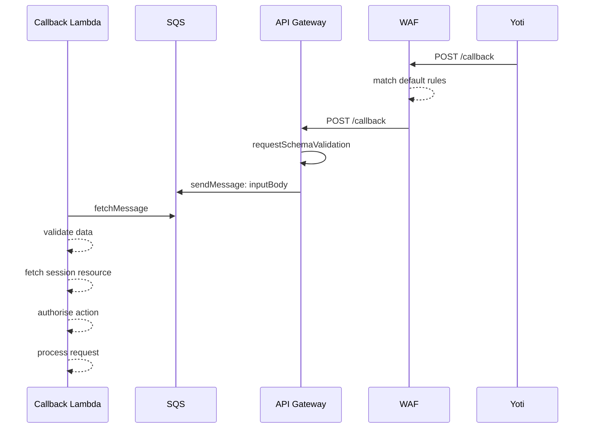
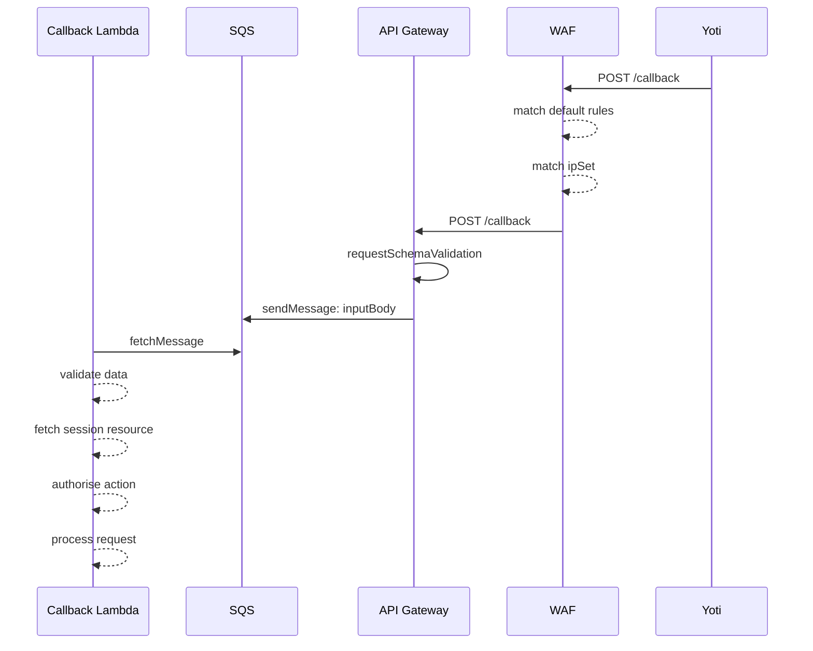
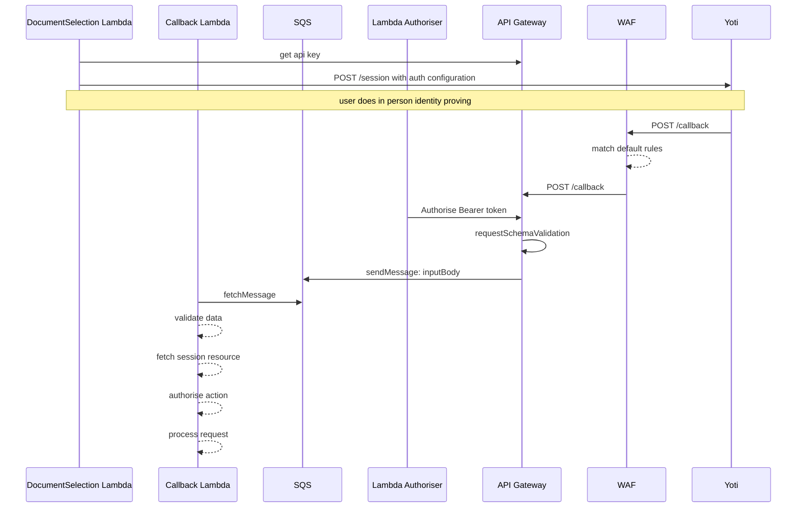
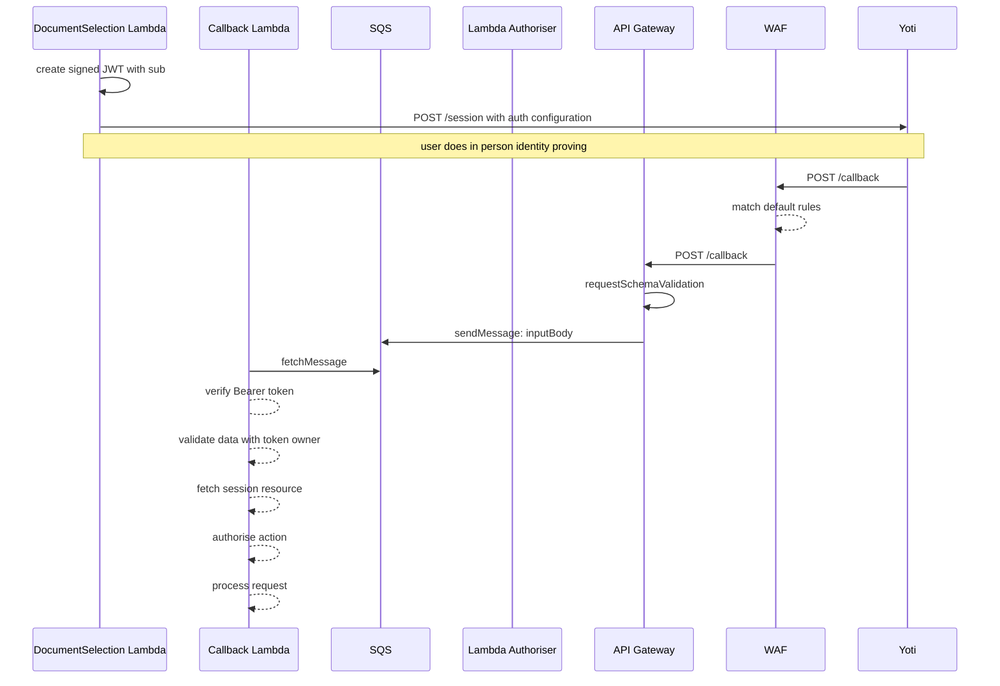

# Callback Authentication

## Status
DRAFT

## Decision

PENDING

## Context

The Face-to-Face Credential Issuer integrates with Yoti by registering a callback handler for notifications when a session is created. Additional configuration for the authorization on the callback handler is available in the Yoti session payload, which looks like this;


```yaml
NotificationPayload:
    type: object
    properties:
        endpoint: ...
        topics: ...
        auth_token:
            description: [OPTIONAL] sent as the base64 encoded value of the Authorization header in notifications.
            type: string
        auth_type:
            description: Authentication scheme directive to use in outbound notifications. Defaults to BASIC.
            type: string
            enum: [BASIC, BEARER]
```

We secure our session callback endpoint with several mechanisms, including WAF & API request validation. This endpoint is still open to the internet & has no mechanism for access management beyond the existing WAF controls. This document looks to record our decisions to introduce access management to minimise cost of execution from invalid requests made by from sources other than our vendor, and to improve the overall security profile of our endpoint.

## Options

### 1 - Do Nothing
We rely on our existing security mechanisms to ensure that a call we receive will only be processed if it is a valid session sent by Yoti. We rely on WAF to protect from attack vectors designed to disrupt or damage service integrity, like DDoS.



### 2 - Passlist
Implement passlist (commonly known as a whitelist) for the endpoint, validating requests come from only allowed IPs. We will pre-register and maintain this list with Yoti, and deploy it as configuration against the endpoint.



The drawback of this option is that IP address based controls may rely on a range of IPs, which may change over time. Without a way for Yoti to manage this themselves it will require an additional maintenance task to mitigate the risk of out of date configuration disrupting the user journey.

### 3 - Authentication Header with API Key
- Use the optional authentication mechanism in the session notification configuration to provide a Bearer token to use4 on all callbacks for that session. 



_Automatic api key validation available in API Gateway is limited to the use of the header `x-api-key`. This is not part of the configuration we can provide to Yoti, so a lambda authoriser is required to validate the Bearer token provided in the Authorization header of the request._

This additional layer of configuration increases the validation done before a request is added to the queue, minimising the number of potential executions of the callback lambda.

The drawback is an additional layer of complexity in the session configuration and the infrastructure required for callback handling. 

### Option 4 Authentication Header with JWT



This adds the additional benefits and drawbacks of option 3, along with;
- additional security of a custom token per session created
- Higher processing costs due to
    - the use of an additional key for token creation, and 
    - additional validation in the callback handler increasing lambda execution time. 

There may be scope to move this validation into a lambda authorizer and use STS:AssumeRoleWithWebIdentity to limit callbacks to only fetch information for the subject identifier of the JWT in the Bearer token. This aligns with the Digital Identity [ADR 84](https://github.com/alphagov/digital-identity-architecture/blob/main/adr/0084-minimising-user-data-access-permissions.md) on User data access controls.

## Consequences

All options but option 1 change the scope of the original MVP design. There has been no ask to improve the security profile of the existing MVP design of the Face-to-Face service, so choosing to add this is a decision made by the team to exceed the minimum requirements.

Providing a mechanism to secure callback URLs separate from the lambda that processes requests does reduce the complexity of the request processing lambdas, separating request validation from business process flow. 