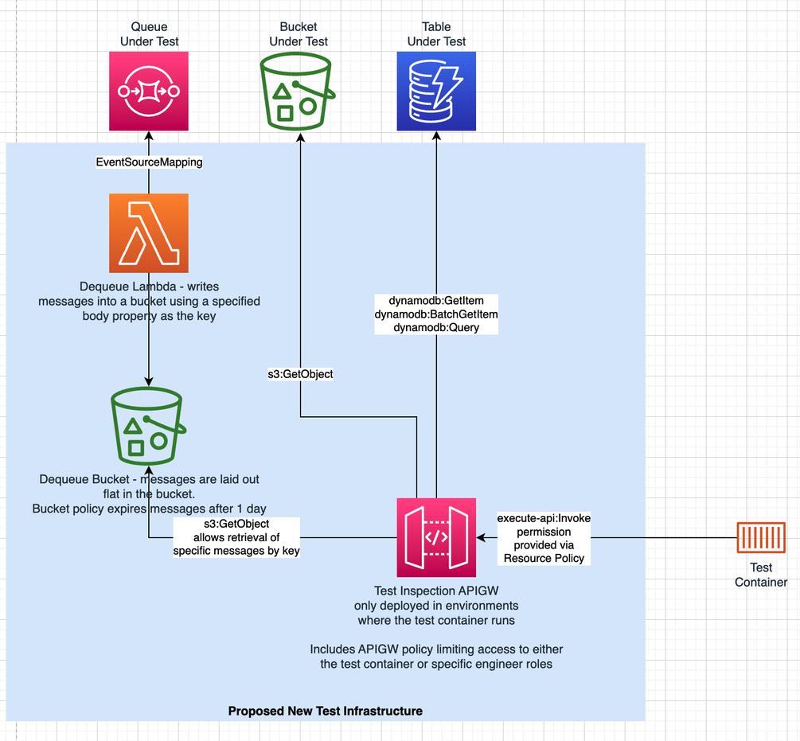

# Test Harness

This is a test harness that listens to events from IPV Core and TxMA SQS queues and puts them in the ${AWS::StackName}-f2f-event-test-${Environment} bucket which can then be accessed using and API.

This test harness is only designed to be used in dev and build environments

## How to use
1. Deploy a custom F2F stack with the changes that you'd like to test. If you would like to test against what is in dev then ignore this step
2. Update the test-harness/samconfig.toml with a stack name, and the backend stack that you'd like to use (if you don't change this the dev stack will be used)
3. Trigger the events that you are looking for 
4. Call the /test-object/{object-key} with a key to get the object from the s3 bucket or without a key to list all objects in the s3 bucket

## Architecture

Note that only the SQS stream has been implemented so far